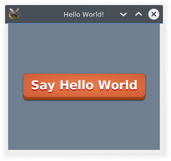

# gradlescript
Shell script for generating a gradle java project, with a simple css skin. This may serve as a startingpoint when trying JavaFX.



Note: This script might become obsolete depending on the state of [Gradle Build Init Plugin] (https://gradle.org/docs/current/userguide/build_init_plugin.html)

```Usage: ./gradlescript myproject```

This command will make the directory, initialize gradle with java-library type, add eclipse, and IntelliJ Idea plugins and add a HelloWorld source file with css skin.

to run the application:

```cd myproject && gradle run```

to generate idea project:

```cd myproject && gradle idea```

to generate eclipse project:

```cd myproject && gradle eclipse```


Tested on
```
------------------------------------------------------------
Gradle 2.3
------------------------------------------------------------

Build time:   2015-02-16 05:09:33 UTC
Build number: none
Revision:     586be72bf6e3df1ee7676d1f2a3afd9157341274

Groovy:       2.3.9
Ant:          Apache Ant(TM) version 1.9.3 compiled on December 23 2013
JVM:          1.8.0_45 (Oracle Corporation 25.45-b02)
OS:           Linux 3.19.0-15-generic amd64
```


*Credits:*

CSS button style: [Jasper Potts] (http://fxexperience.com/2011/12/styling-fx-buttons-with-css/)
